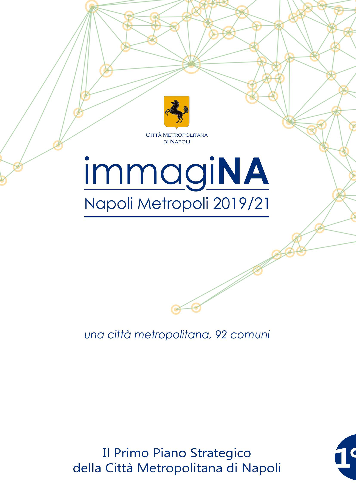

####################################################
Piano Strategico della Città Metropolitana di Napoli
####################################################

|immagiNA|

.. highlights::  

Questo documento contiene il primo Piano Stratetegico della Città Metropolitana di Napoli

|logo_urp| *Ufficio Per le Relazioni con il Pubblico*

:Proprietà: Città Metropolitana di Napoli
:Publisher: Ufficio Relazioni con il Pubblico
:Licenza: CC BY-NC-ND 2.0 IT|cc-by-nc-nd|
 
.. toctree::
  :maxdepth: 3
  :numbered:

Lettera del Sindaco Metropolitano
1. Un processo in divenire 
1.1. Ruolo strategico della Città Metropolitana di Napoli 
1.2. Fasi del Piano Strategico 
2.1. Processo di costruzione delle scelte condivise 
2.2. Zone omogenee
2.3 Il Forum Metropolitano
2.4 Progetti Crossover 
2.4.2 Progetti Crossover - Asse prioritario A.2 “Scuole presidio di legalità ed integrazione”
2.4.3 Progetti Crossover - Asse prioritario A.3 “Autostrade digitali” 
2.4.4 Progetti Crossover - Asse prioritario B.1 “Consumo di suolo zero”
2.4.5 Progetti Crossover - Asse prioritario B.2 “Ossigeno Bene Comune” 
3.1 Analisi del Contesto 
Imprese attive per settore
Imprese attive per settore
3.2. Il rapporto con la pianificazione territoriale di livello metropolitano
4.1. Direttrici, Assi e Azioni
4.2 Città Metropolitana investe nelle comunità locali
4.3. Città globale: investimenti integrati possibili 
5.1 Valutazione, monitoraggio e aggiornamento del Piano 
  index/Introduzione.rst
  index/A-cosa-serve-il-Portale-Utenti.rst
  index/Credenziali-di-accesso.rst
  index/Accesso-al-Portale-Utenti.rst
  index/Assistenza-Portale-Utenti.rst

.. |cc-by-nc-nd| image:: assets/images/by-nc-nd.png

